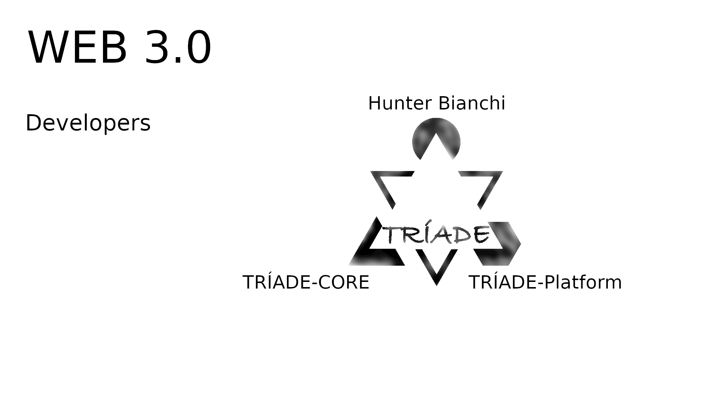
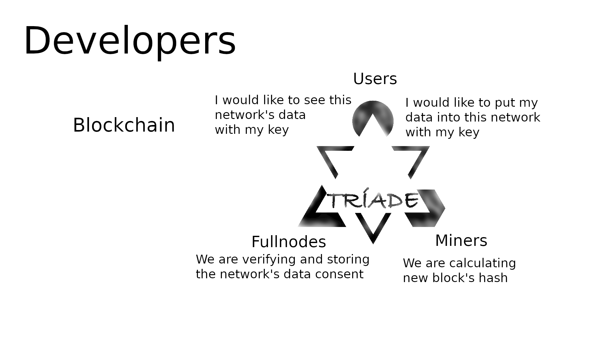

# TRÍADE-API

## The interface between all application's datas and all peer nodes.

___

<table role="table" class="chakra-table css-arnyt4"><thead><tr><th align="center">Stack</th><th align="left">Name</th><th align="center">Gas</th><th align="left">Initial Stack</th><th align="left">Resulting Stack</th><th align="left">Mem / Storage</th><th align="left">Notes</th><th></th></tr></thead><tbody><tr><td align="center">00</td><td align="left">STOP</td><td align="center">0</td><td align="left"></td><td align="left"></td><td align="left"></td><td align="left">halt execution</td><td></td></tr><tr><td align="center">01</td><td align="left">ADD</td><td align="center">3</td><td align="left"><code>a, b</code></td><td align="left"><code>a + b</code></td><td align="left"></td><td align="left">(u)int256 addition modulo 2**256</td><td></td></tr><tr><td align="center">02</td><td align="left">MUL</td><td align="center">5</td><td align="left"><code>a, b</code></td><td align="left"><code>a * b</code></td><td align="left"></td><td align="left">(u)int256 multiplication modulo 2**256</td><td></td></tr><tr><td align="center">03</td><td align="left">SUB</td><td align="center">3</td><td align="left"><code>a, b</code></td><td align="left"><code>a - b</code></td><td align="left"></td><td align="left">(u)int256 addition modulo 2**256</td><td></td></tr><tr><td align="center">04</td><td align="left">DIV</td><td align="center">5</td><td align="left"><code>a, b</code></td><td align="left"><code>a // b</code></td><td align="left"></td><td align="left">uint256 division</td><td></td></tr><tr><td align="center">05</td><td align="left">SDIV</td><td align="center">5</td><td align="left"><code>a, b</code></td><td align="left"><code>a // b</code></td><td align="left"></td><td align="left">int256 division</td><td></td></tr><tr><td align="center">06</td><td align="left">MOD</td><td align="center">5</td><td align="left"><code>a, b</code></td><td align="left"><code>a % b</code></td><td align="left"></td><td align="left">uint256 modulus</td><td></td></tr><tr><td align="center">07</td><td align="left">SMOD</td><td align="center">5</td><td align="left"><code>a, b</code></td><td align="left"><code>a % b</code></td><td align="left"></td><td align="left">int256 modulus</td><td></td></tr><tr><td align="center">08</td><td align="left">ADDMOD</td><td align="center">8</td><td align="left"><code>a, b, N</code></td><td align="left"><code>(a + b) % N</code></td><td align="left"></td><td align="left">(u)int256 addition modulo N</td><td></td></tr><tr><td align="center">09</td><td align="left">MULMOD</td><td align="center">8</td><td align="left"><code>a, b, N</code></td><td align="left"><code>(a * b) % N</code></td><td align="left"></td><td align="left">(u)int256 multiplication modulo N</td><td></td></tr><tr><td align="center">0A</td><td align="left">EXP</td><td align="center"><a target="_blank" rel="noopener" class="chakra-link css-1q55j7y" href="https://github.com/wolflo/evm-opcodes/blob/main/gas.md#a1-exp" dir="ltr">A1</a></td><td align="left"><code>a, b</code></td><td align="left"><code>a ** b</code></td><td align="left"></td><td align="left">uint256 exponentiation modulo 2**256</td><td></td></tr><tr><td align="center">0B</td><td align="left">SIGNEXTEND</td><td align="center">5</td><td align="left"><code>b, x</code></td><td align="left"><code>SIGNEXTEND(x, b)</code></td><td align="left"></td><td align="left"><a target="_blank" rel="noopener" class="chakra-link css-1q55j7y" href="https://wikipedia.org/wiki/Sign_extension" dir="ltr">sign extend</a> <code>x</code> from <code>(b+1)</code> bytes to 32 bytes</td><td></td></tr><tr><td align="center">0C-0F</td><td align="left"><em>invalid</em></td><td align="center"></td><td align="left"></td><td align="left"></td><td align="left"></td><td align="left"></td><td></td></tr><tr><td align="center">10</td><td align="left">LT</td><td align="center">3</td><td align="left"><code>a, b</code></td><td align="left"><code>a &lt; b</code></td><td align="left"></td><td align="left">uint256 less-than</td><td></td></tr><tr><td align="center">11</td><td align="left">GT</td><td align="center">3</td><td align="left"><code>a, b</code></td><td align="left"><code>a &gt; b</code></td><td align="left"></td><td align="left">uint256 greater-than</td><td></td></tr><tr><td align="center">12</td><td align="left">SLT</td><td align="center">3</td><td align="left"><code>a, b</code></td><td align="left"><code>a &lt; b</code></td><td align="left"></td><td align="left">int256 less-than</td><td></td></tr><tr><td align="center">13</td><td align="left">SGT</td><td align="center">3</td><td align="left"><code>a, b</code></td><td align="left"><code>a &gt; b</code></td><td align="left"></td><td align="left">int256 greater-than</td><td></td></tr><tr><td align="center">14</td><td align="left">EQ</td><td align="center">3</td><td align="left"><code>a, b</code></td><td align="left"><code>a == b</code></td><td align="left"></td><td align="left">(u)int256 equality</td><td></td></tr><tr><td align="center">15</td><td align="left">ISZERO</td><td align="center">3</td><td align="left"><code>a</code></td><td align="left"><code>a == 0</code></td><td align="left"></td><td align="left">(u)int256 iszero</td><td></td></tr><tr><td align="center">16</td><td align="left">AND</td><td align="center">3</td><td align="left"><code>a, b</code></td><td align="left"><code>a &amp;&amp; b</code></td><td align="left"></td><td align="left">bitwise AND</td><td></td></tr><tr><td align="center">17</td><td align="left">OR</td><td align="center">3</td><td align="left"><code>a, b</code></td><td align="left"><code>a \|\| b</code></td><td align="left"></td><td align="left">bitwise OR</td><td></td></tr><tr><td align="center">18</td><td align="left">XOR</td><td align="center">3</td><td align="left"><code>a, b</code></td><td align="left"><code>a ^ b</code></td><td align="left"></td><td align="left">bitwise XOR</td><td></td></tr><tr><td align="center">19</td><td align="left">NOT</td><td align="center">3</td><td align="left"><code>a</code></td><td align="left"><code>~a</code></td><td align="left"></td><td align="left">bitwise NOT</td><td></td></tr><tr><td align="center">1A</td><td align="left">BYTE</td><td align="center">3</td><td align="left"><code>i, x</code></td><td align="left"><code>(x &gt;&gt; (248 - i * 8)) &amp;&amp; 0xFF</code></td><td align="left"></td><td align="left"><code>i</code>th byte of (u)int256 <code>x</code>, from the left</td><td></td></tr><tr><td align="center">1B</td><td align="left">SHL</td><td align="center">3</td><td align="left"><code>shift, val</code></td><td align="left"><code>val &lt;&lt; shift</code></td><td align="left"></td><td align="left">shift left</td><td></td></tr><tr><td align="center">1C</td><td align="left">SHR</td><td align="center">3</td><td align="left"><code>shift, val</code></td><td align="left"><code>val &gt;&gt; shift</code></td><td align="left"></td><td align="left">logical shift right</td><td></td></tr><tr><td align="center">1D</td><td align="left">SAR</td><td align="center">3</td><td align="left"><code>shift, val</code></td><td align="left"><code>val &gt;&gt; shift</code></td><td align="left"></td><td align="left">arithmetic shift right</td><td></td></tr><tr><td align="center">1E-1F</td><td align="left"><em>invalid</em></td><td align="center"></td><td align="left"></td><td align="left"></td><td align="left"></td><td align="left"></td><td></td></tr><tr><td align="center">20</td><td align="left">KECCAK256</td><td align="center"><a target="_blank" rel="noopener" class="chakra-link css-1q55j7y" href="https://github.com/wolflo/evm-opcodes/blob/main/gas.md#a2-sha3" dir="ltr">A2</a></td><td align="left"><code>ost, len</code></td><td align="left"><code>keccak256(mem[ost:ost+len-1])</code></td><td align="left"></td><td align="left">keccak256</td><td></td></tr><tr><td align="center">21-2F</td><td align="left"><em>invalid</em></td><td align="center"></td><td align="left"></td><td align="left"></td><td align="left"></td><td align="left"></td><td></td></tr><tr><td align="center">30</td><td align="left">ADDRESS</td><td align="center">2</td><td align="left"><code>.</code></td><td align="left"><code>address(this)</code></td><td align="left"></td><td align="left">address of executing contract</td><td></td></tr><tr><td align="center">31</td><td align="left">BALANCE</td><td align="center"><a target="_blank" rel="noopener" class="chakra-link css-1q55j7y" href="https://github.com/wolflo/evm-opcodes/blob/main/gas.md#a5-balance-extcodesize-extcodehash" dir="ltr">A5</a></td><td align="left"><code>addr</code></td><td align="left"><code>addr.balance</code></td><td align="left"></td><td align="left">balance, in wei</td><td></td></tr><tr><td align="center">32</td><td align="left">ORIGIN</td><td align="center">2</td><td align="left"><code>.</code></td><td align="left"><code>tx.origin</code></td><td align="left"></td><td align="left">address that originated the tx</td><td></td></tr><tr><td align="center">33</td><td align="left">CALLER</td><td align="center">2</td><td align="left"><code>.</code></td><td align="left"><code>msg.sender</code></td><td align="left"></td><td align="left">address of msg sender</td><td></td></tr><tr><td align="center">34</td><td align="left">CALLVALUE</td><td align="center">2</td><td align="left"><code>.</code></td><td align="left"><code>msg.value</code></td><td align="left"></td><td align="left">msg value, in wei</td><td></td></tr><tr><td align="center">35</td><td align="left">CALLDATALOAD</td><td align="center">3</td><td align="left"><code>idx</code></td><td align="left"><code>msg.data[idx:idx+32]</code></td><td align="left"></td><td align="left">read word from msg data at index <code>idx</code></td><td></td></tr><tr><td align="center">36</td><td align="left">CALLDATASIZE</td><td align="center">2</td><td align="left"><code>.</code></td><td align="left"><code>len(msg.data)</code></td><td align="left"></td><td align="left">length of msg data, in bytes</td><td></td></tr><tr><td align="center">37</td><td align="left">CALLDATACOPY</td><td align="center"><a target="_blank" rel="noopener" class="chakra-link css-1q55j7y" href="https://github.com/wolflo/evm-opcodes/blob/main/gas.md#a3-copy-operations" dir="ltr">A3</a></td><td align="left"><code>dstOst, ost, len</code></td><td align="left"><code>.</code></td><td align="left">mem[dstOst:dstOst+len-1] := msg.data[ost:ost+len-1]</td><td align="left">copy msg data</td><td></td></tr><tr><td align="center">38</td><td align="left">CODESIZE</td><td align="center">2</td><td align="left"><code>.</code></td><td align="left"><code>len(this.code)</code></td><td align="left"></td><td align="left">length of executing contract's code, in bytes</td><td></td></tr><tr><td align="center">39</td><td align="left">CODECOPY</td><td align="center"><a target="_blank" rel="noopener" class="chakra-link css-1q55j7y" href="https://github.com/wolflo/evm-opcodes/blob/main/gas.md#a3-copy-operations" dir="ltr">A3</a></td><td align="left"><code>dstOst, ost, len</code></td><td align="left"><code>.</code></td><td align="left"></td><td align="left">mem[dstOst:dstOst+len-1] := this.code[ost:ost+len-1]</td><td>copy executing contract's bytecode</td></tr><tr><td align="center">3A</td><td align="left">GASPRICE</td><td align="center">2</td><td align="left"><code>.</code></td><td align="left"><code>tx.gasprice</code></td><td align="left"></td><td align="left">gas price of tx, in wei per unit gas <a target="_blank" rel="noopener" class="chakra-link css-1q55j7y" href="https://github.com/ethereum/EIPs/blob/0341984ff14c8ce398f6d2b3e009c07cd99df8eb/EIPS/eip-1559.md#gasprice" dir="ltr">**</a></td><td></td></tr><tr><td align="center">3B</td><td align="left">EXTCODESIZE</td><td align="center"><a target="_blank" rel="noopener" class="chakra-link css-1q55j7y" href="https://github.com/wolflo/evm-opcodes/blob/main/gas.md#a5-balance-extcodesize-extcodehash" dir="ltr">A5</a></td><td align="left"><code>addr</code></td><td align="left"><code>len(addr.code)</code></td><td align="left"></td><td align="left">size of code at addr, in bytes</td><td></td></tr><tr><td align="center">3C</td><td align="left">EXTCODECOPY</td><td align="center"><a target="_blank" rel="noopener" class="chakra-link css-1q55j7y" href="https://github.com/wolflo/evm-opcodes/blob/main/gas.md#a4-extcodecopy" dir="ltr">A4</a></td><td align="left"><code>addr, dstOst, ost, len</code></td><td align="left"><code>.</code></td><td align="left">mem[dstOst:dstOst+len-1] := addr.code[ost:ost+len-1]</td><td align="left">copy code from <code>addr</code></td><td></td></tr><tr><td align="center">3D</td><td align="left">RETURNDATASIZE</td><td align="center">2</td><td align="left"><code>.</code></td><td align="left"><code>size</code></td><td align="left"></td><td align="left">size of returned data from last external call, in bytes</td><td></td></tr><tr><td align="center">3E</td><td align="left">RETURNDATACOPY</td><td align="center"><a target="_blank" rel="noopener" class="chakra-link css-1q55j7y" href="https://github.com/wolflo/evm-opcodes/blob/main/gas.md#a3-copy-operations" dir="ltr">A3</a></td><td align="left"><code>dstOst, ost, len</code></td><td align="left"><code>.</code></td><td align="left">mem[dstOst:dstOst+len-1] := returndata[ost:ost+len-1]</td><td align="left">copy returned data from last external call</td><td></td></tr><tr><td align="center">3F</td><td align="left">EXTCODEHASH</td><td align="center"><a target="_blank" rel="noopener" class="chakra-link css-1q55j7y" href="https://github.com/wolflo/evm-opcodes/blob/main/gas.md#a5-balance-extcodesize-extcodehash" dir="ltr">A5</a></td><td align="left"><code>addr</code></td><td align="left"><code>hash</code></td><td align="left"></td><td align="left">hash = addr.exists ? keccak256(addr.code) : 0</td><td></td></tr><tr><td align="center">40</td><td align="left">BLOCKHASH</td><td align="center">20</td><td align="left"><code>blockNum</code></td><td align="left"><code>blockHash(blockNum)</code></td><td align="left"></td><td align="left"></td><td></td></tr><tr><td align="center">41</td><td align="left">COINBASE</td><td align="center">2</td><td align="left"><code>.</code></td><td align="left"><code>block.coinbase</code></td><td align="left"></td><td align="left">address of miner of current block</td><td></td></tr><tr><td align="center">42</td><td align="left">TIMESTAMP</td><td align="center">2</td><td align="left"><code>.</code></td><td align="left"><code>block.timestamp</code></td><td align="left"></td><td align="left">timestamp of current block</td><td></td></tr><tr><td align="center">43</td><td align="left">NUMBER</td><td align="center">2</td><td align="left"><code>.</code></td><td align="left"><code>block.number</code></td><td align="left"></td><td align="left">number of current block</td><td></td></tr><tr><td align="center">44</td><td align="left">PREVRANDAO</td><td align="center">2</td><td align="left"><code>.</code></td><td align="left"><code>randomness beacon</code></td><td align="left"></td><td align="left">randomness beacon</td><td></td></tr><tr><td align="center">45</td><td align="left">GASLIMIT</td><td align="center">2</td><td align="left"><code>.</code></td><td align="left"><code>block.gaslimit</code></td><td align="left"></td><td align="left">gas limit of current block</td><td></td></tr><tr><td align="center">46</td><td align="left">CHAINID</td><td align="center">2</td><td align="left"><code>.</code></td><td align="left"><code>chain_id</code></td><td align="left"></td><td align="left">push current <a target="_blank" rel="noopener" class="chakra-link css-1q55j7y" href="https://eips.ethereum.org/EIPS/eip-155" dir="ltr">chain id</a> onto stack</td><td></td></tr><tr><td align="center">47</td><td align="left">SELFBALANCE</td><td align="center">5</td><td align="left"><code>.</code></td><td align="left"><code>address(this).balance</code></td><td align="left"></td><td align="left">balance of executing contract, in wei</td><td></td></tr><tr><td align="center">48</td><td align="left">BASEFEE</td><td align="center">2</td><td align="left"><code>.</code></td><td align="left"><code>block.basefee</code></td><td align="left"></td><td align="left">base fee of current block</td><td></td></tr><tr><td align="center">49-4F</td><td align="left"><em>invalid</em></td><td align="center"></td><td align="left"></td><td align="left"></td><td align="left"></td><td align="left"></td><td></td></tr><tr><td align="center">50</td><td align="left">POP</td><td align="center">2</td><td align="left"><code>_anon</code></td><td align="left"><code>.</code></td><td align="left"></td><td align="left">remove item from top of stack and discard it</td><td></td></tr><tr><td align="center">51</td><td align="left">MLOAD</td><td align="center">3<a target="_blank" rel="noopener" class="chakra-link css-1q55j7y" href="https://github.com/wolflo/evm-opcodes/blob/main/gas.md#a0-1-memory-expansion" dir="ltr">*</a></td><td align="left"><code>ost</code></td><td align="left"><code>mem[ost:ost+32]</code></td><td align="left"></td><td align="left">read word from memory at offset <code>ost</code></td><td></td></tr><tr><td align="center">52</td><td align="left">MSTORE</td><td align="center">3<a target="_blank" rel="noopener" class="chakra-link css-1q55j7y" href="https://github.com/wolflo/evm-opcodes/blob/main/gas.md#a0-1-memory-expansion" dir="ltr">*</a></td><td align="left"><code>ost, val</code></td><td align="left"><code>.</code></td><td align="left">mem[ost:ost+32] := val</td><td align="left">write a word to memory</td><td></td></tr><tr><td align="center">53</td><td align="left">MSTORE8</td><td align="center">3<a target="_blank" rel="noopener" class="chakra-link css-1q55j7y" href="https://github.com/wolflo/evm-opcodes/blob/main/gas.md#a0-1-memory-expansion" dir="ltr">*</a></td><td align="left"><code>ost, val</code></td><td align="left"><code>.</code></td><td align="left">mem[ost] := val &amp;&amp; 0xFF</td><td align="left">write a single byte to memory</td><td></td></tr><tr><td align="center">54</td><td align="left">SLOAD</td><td align="center"><a target="_blank" rel="noopener" class="chakra-link css-1q55j7y" href="https://github.com/wolflo/evm-opcodes/blob/main/gas.md#a6-sload" dir="ltr">A6</a></td><td align="left"><code>key</code></td><td align="left"><code>storage[key]</code></td><td align="left"></td><td align="left">read word from storage</td><td></td></tr><tr><td align="center">55</td><td align="left">SSTORE</td><td align="center"><a target="_blank" rel="noopener" class="chakra-link css-1q55j7y" href="https://github.com/wolflo/evm-opcodes/blob/main/gas.md#a7-sstore" dir="ltr">A7</a></td><td align="left"><code>key, val</code></td><td align="left"><code>.</code></td><td align="left">storage[key] := val</td><td align="left">write word to storage</td><td></td></tr><tr><td align="center">56</td><td align="left">JUMP</td><td align="center">8</td><td align="left"><code>dst</code></td><td align="left"><code>.</code></td><td align="left"></td><td align="left"><code>$pc := dst</code> mark that <code>pc</code> is only assigned if <code>dst</code> is a valid jumpdest</td><td></td></tr><tr><td align="center">57</td><td align="left">JUMPI</td><td align="center">10</td><td align="left"><code>dst, condition</code></td><td align="left"><code>.</code></td><td align="left"></td><td align="left"><code>$pc := condition ? dst : $pc + 1</code></td><td></td></tr><tr><td align="center">58</td><td align="left">PC</td><td align="center">2</td><td align="left"><code>.</code></td><td align="left"><code>$pc</code></td><td align="left"></td><td align="left">program counter</td><td></td></tr><tr><td align="center">59</td><td align="left">MSIZE</td><td align="center">2</td><td align="left"><code>.</code></td><td align="left"><code>len(mem)</code></td><td align="left"></td><td align="left">size of memory in current execution context, in bytes</td><td></td></tr><tr><td align="center">5A</td><td align="left">GAS</td><td align="center">2</td><td align="left"><code>.</code></td><td align="left"><code>gasRemaining</code></td><td align="left"></td><td align="left"></td><td></td></tr><tr><td align="center">5B</td><td align="left">JUMPDEST</td><td align="center">1</td><td align="left"></td><td align="left"></td><td align="left">mark valid jump destination</td><td align="left">a valid jump destination for example a jump destination not inside the push data</td><td></td></tr><tr><td align="center">5C-5F</td><td align="left"><em>invalid</em></td><td align="center"></td><td align="left"></td><td align="left"></td><td align="left"></td><td align="left"></td><td></td></tr><tr><td align="center">60</td><td align="left">PUSH1</td><td align="center">3</td><td align="left"><code>.</code></td><td align="left"><code>uint8</code></td><td align="left"></td><td align="left">push 1-byte value onto stack</td><td></td></tr><tr><td align="center">61</td><td align="left">PUSH2</td><td align="center">3</td><td align="left"><code>.</code></td><td align="left"><code>uint16</code></td><td align="left"></td><td align="left">push 2-byte value onto stack</td><td></td></tr><tr><td align="center">62</td><td align="left">PUSH3</td><td align="center">3</td><td align="left"><code>.</code></td><td align="left"><code>uint24</code></td><td align="left"></td><td align="left">push 3-byte value onto stack</td><td></td></tr><tr><td align="center">63</td><td align="left">PUSH4</td><td align="center">3</td><td align="left"><code>.</code></td><td align="left"><code>uint32</code></td><td align="left"></td><td align="left">push 4-byte value onto stack</td><td></td></tr><tr><td align="center">64</td><td align="left">PUSH5</td><td align="center">3</td><td align="left"><code>.</code></td><td align="left"><code>uint40</code></td><td align="left"></td><td align="left">push 5-byte value onto stack</td><td></td></tr><tr><td align="center">65</td><td align="left">PUSH6</td><td align="center">3</td><td align="left"><code>.</code></td><td align="left"><code>uint48</code></td><td align="left"></td><td align="left">push 6-byte value onto stack</td><td></td></tr><tr><td align="center">66</td><td align="left">PUSH7</td><td align="center">3</td><td align="left"><code>.</code></td><td align="left"><code>uint56</code></td><td align="left"></td><td align="left">push 7-byte value onto stack</td><td></td></tr><tr><td align="center">67</td><td align="left">PUSH8</td><td align="center">3</td><td align="left"><code>.</code></td><td align="left"><code>uint64</code></td><td align="left"></td><td align="left">push 8-byte value onto stack</td><td></td></tr><tr><td align="center">68</td><td align="left">PUSH9</td><td align="center">3</td><td align="left"><code>.</code></td><td align="left"><code>uint72</code></td><td align="left"></td><td align="left">push 9-byte value onto stack</td><td></td></tr><tr><td align="center">69</td><td align="left">PUSH10</td><td align="center">3</td><td align="left"><code>.</code></td><td align="left"><code>uint80</code></td><td align="left"></td><td align="left">push 10-byte value onto stack</td><td></td></tr><tr><td align="center">6A</td><td align="left">PUSH11</td><td align="center">3</td><td align="left"><code>.</code></td><td align="left"><code>uint88</code></td><td align="left"></td><td align="left">push 11-byte value onto stack</td><td></td></tr><tr><td align="center">6B</td><td align="left">PUSH12</td><td align="center">3</td><td align="left"><code>.</code></td><td align="left"><code>uint96</code></td><td align="left"></td><td align="left">push 12-byte value onto stack</td><td></td></tr><tr><td align="center">6C</td><td align="left">PUSH13</td><td align="center">3</td><td align="left"><code>.</code></td><td align="left"><code>uint104</code></td><td align="left"></td><td align="left">push 13-byte value onto stack</td><td></td></tr><tr><td align="center">6D</td><td align="left">PUSH14</td><td align="center">3</td><td align="left"><code>.</code></td><td align="left"><code>uint112</code></td><td align="left"></td><td align="left">push 14-byte value onto stack</td><td></td></tr><tr><td align="center">6E</td><td align="left">PUSH15</td><td align="center">3</td><td align="left"><code>.</code></td><td align="left"><code>uint120</code></td><td align="left"></td><td align="left">push 15-byte value onto stack</td><td></td></tr><tr><td align="center">6F</td><td align="left">PUSH16</td><td align="center">3</td><td align="left"><code>.</code></td><td align="left"><code>uint128</code></td><td align="left"></td><td align="left">push 16-byte value onto stack</td><td></td></tr><tr><td align="center">70</td><td align="left">PUSH17</td><td align="center">3</td><td align="left"><code>.</code></td><td align="left"><code>uint136</code></td><td align="left"></td><td align="left">push 17-byte value onto stack</td><td></td></tr><tr><td align="center">71</td><td align="left">PUSH18</td><td align="center">3</td><td align="left"><code>.</code></td><td align="left"><code>uint144</code></td><td align="left"></td><td align="left">push 18-byte value onto stack</td><td></td></tr><tr><td align="center">72</td><td align="left">PUSH19</td><td align="center">3</td><td align="left"><code>.</code></td><td align="left"><code>uint152</code></td><td align="left"></td><td align="left">push 19-byte value onto stack</td><td></td></tr><tr><td align="center">73</td><td align="left">PUSH20</td><td align="center">3</td><td align="left"><code>.</code></td><td align="left"><code>uint160</code></td><td align="left"></td><td align="left">push 20-byte value onto stack</td><td></td></tr><tr><td align="center">74</td><td align="left">PUSH21</td><td align="center">3</td><td align="left"><code>.</code></td><td align="left"><code>uint168</code></td><td align="left"></td><td align="left">push 21-byte value onto stack</td><td></td></tr><tr><td align="center">75</td><td align="left">PUSH22</td><td align="center">3</td><td align="left"><code>.</code></td><td align="left"><code>uint176</code></td><td align="left"></td><td align="left">push 22-byte value onto stack</td><td></td></tr><tr><td align="center">76</td><td align="left">PUSH23</td><td align="center">3</td><td align="left"><code>.</code></td><td align="left"><code>uint184</code></td><td align="left"></td><td align="left">push 23-byte value onto stack</td><td></td></tr><tr><td align="center">77</td><td align="left">PUSH24</td><td align="center">3</td><td align="left"><code>.</code></td><td align="left"><code>uint192</code></td><td align="left"></td><td align="left">push 24-byte value onto stack</td><td></td></tr><tr><td align="center">78</td><td align="left">PUSH25</td><td align="center">3</td><td align="left"><code>.</code></td><td align="left"><code>uint200</code></td><td align="left"></td><td align="left">push 25-byte value onto stack</td><td></td></tr><tr><td align="center">79</td><td align="left">PUSH26</td><td align="center">3</td><td align="left"><code>.</code></td><td align="left"><code>uint208</code></td><td align="left"></td><td align="left">push 26-byte value onto stack</td><td></td></tr><tr><td align="center">7A</td><td align="left">PUSH27</td><td align="center">3</td><td align="left"><code>.</code></td><td align="left"><code>uint216</code></td><td align="left"></td><td align="left">push 27-byte value onto stack</td><td></td></tr><tr><td align="center">7B</td><td align="left">PUSH28</td><td align="center">3</td><td align="left"><code>.</code></td><td align="left"><code>uint224</code></td><td align="left"></td><td align="left">push 28-byte value onto stack</td><td></td></tr><tr><td align="center">7C</td><td align="left">PUSH29</td><td align="center">3</td><td align="left"><code>.</code></td><td align="left"><code>uint232</code></td><td align="left"></td><td align="left">push 29-byte value onto stack</td><td></td></tr><tr><td align="center">7D</td><td align="left">PUSH30</td><td align="center">3</td><td align="left"><code>.</code></td><td align="left"><code>uint240</code></td><td align="left"></td><td align="left">push 30-byte value onto stack</td><td></td></tr><tr><td align="center">7E</td><td align="left">PUSH31</td><td align="center">3</td><td align="left"><code>.</code></td><td align="left"><code>uint248</code></td><td align="left"></td><td align="left">push 31-byte value onto stack</td><td></td></tr><tr><td align="center">7F</td><td align="left">PUSH32</td><td align="center">3</td><td align="left"><code>.</code></td><td align="left"><code>uint256</code></td><td align="left"></td><td align="left">push 32-byte value onto stack</td><td></td></tr><tr><td align="center">80</td><td align="left">DUP1</td><td align="center">3</td><td align="left"><code>a</code></td><td align="left"><code>a, a</code></td><td align="left"></td><td align="left">clone 1st value on stack</td><td></td></tr><tr><td align="center">81</td><td align="left">DUP2</td><td align="center">3</td><td align="left"><code>_, a</code></td><td align="left"><code>a, _, a</code></td><td align="left"></td><td align="left">clone 2nd value on stack</td><td></td></tr><tr><td align="center">82</td><td align="left">DUP3</td><td align="center">3</td><td align="left"><code>_, _, a</code></td><td align="left"><code>a, _, _, a</code></td><td align="left"></td><td align="left">clone 3rd value on stack</td><td></td></tr><tr><td align="center">83</td><td align="left">DUP4</td><td align="center">3</td><td align="left"><code>_, _, _, a</code></td><td align="left"><code>a, _, _, _, a</code></td><td align="left"></td><td align="left">clone 4th value on stack</td><td></td></tr><tr><td align="center">84</td><td align="left">DUP5</td><td align="center">3</td><td align="left"><code>..., a</code></td><td align="left"><code>a, ..., a</code></td><td align="left"></td><td align="left">clone 5th value on stack</td><td></td></tr><tr><td align="center">85</td><td align="left">DUP6</td><td align="center">3</td><td align="left"><code>..., a</code></td><td align="left"><code>a, ..., a</code></td><td align="left"></td><td align="left">clone 6th value on stack</td><td></td></tr><tr><td align="center">86</td><td align="left">DUP7</td><td align="center">3</td><td align="left"><code>..., a</code></td><td align="left"><code>a, ..., a</code></td><td align="left"></td><td align="left">clone 7th value on stack</td><td></td></tr><tr><td align="center">87</td><td align="left">DUP8</td><td align="center">3</td><td align="left"><code>..., a</code></td><td align="left"><code>a, ..., a</code></td><td align="left"></td><td align="left">clone 8th value on stack</td><td></td></tr><tr><td align="center">88</td><td align="left">DUP9</td><td align="center">3</td><td align="left"><code>..., a</code></td><td align="left"><code>a, ..., a</code></td><td align="left"></td><td align="left">clone 9th value on stack</td><td></td></tr><tr><td align="center">89</td><td align="left">DUP10</td><td align="center">3</td><td align="left"><code>..., a</code></td><td align="left"><code>a, ..., a</code></td><td align="left"></td><td align="left">clone 10th value on stack</td><td></td></tr><tr><td align="center">8A</td><td align="left">DUP11</td><td align="center">3</td><td align="left"><code>..., a</code></td><td align="left"><code>a, ..., a</code></td><td align="left"></td><td align="left">clone 11th value on stack</td><td></td></tr><tr><td align="center">8B</td><td align="left">DUP12</td><td align="center">3</td><td align="left"><code>..., a</code></td><td align="left"><code>a, ..., a</code></td><td align="left"></td><td align="left">clone 12th value on stack</td><td></td></tr><tr><td align="center">8C</td><td align="left">DUP13</td><td align="center">3</td><td align="left"><code>..., a</code></td><td align="left"><code>a, ..., a</code></td><td align="left"></td><td align="left">clone 13th value on stack</td><td></td></tr><tr><td align="center">8D</td><td align="left">DUP14</td><td align="center">3</td><td align="left"><code>..., a</code></td><td align="left"><code>a, ..., a</code></td><td align="left"></td><td align="left">clone 14th value on stack</td><td></td></tr><tr><td align="center">8E</td><td align="left">DUP15</td><td align="center">3</td><td align="left"><code>..., a</code></td><td align="left"><code>a, ..., a</code></td><td align="left"></td><td align="left">clone 15th value on stack</td><td></td></tr><tr><td align="center">8F</td><td align="left">DUP16</td><td align="center">3</td><td align="left"><code>..., a</code></td><td align="left"><code>a, ..., a</code></td><td align="left"></td><td align="left">clone 16th value on stack</td><td></td></tr><tr><td align="center">90</td><td align="left">SWAP1</td><td align="center">3</td><td align="left"><code>a, b</code></td><td align="left"><code>b, a</code></td><td align="left"></td><td align="left"></td><td></td></tr><tr><td align="center">91</td><td align="left">SWAP2</td><td align="center">3</td><td align="left"><code>a, _, b</code></td><td align="left"><code>b, _, a</code></td><td align="left"></td><td align="left"></td><td></td></tr><tr><td align="center">92</td><td align="left">SWAP3</td><td align="center">3</td><td align="left"><code>a, _, _, b</code></td><td align="left"><code>b, _, _, a</code></td><td align="left"></td><td align="left"></td><td></td></tr><tr><td align="center">93</td><td align="left">SWAP4</td><td align="center">3</td><td align="left"><code>a, _, _, _, b</code></td><td align="left"><code>b, _, _, _, a</code></td><td align="left"></td><td align="left"></td><td></td></tr><tr><td align="center">94</td><td align="left">SWAP5</td><td align="center">3</td><td align="left"><code>a, ..., b</code></td><td align="left"><code>b, ..., a</code></td><td align="left"></td><td align="left"></td><td></td></tr><tr><td align="center">95</td><td align="left">SWAP6</td><td align="center">3</td><td align="left"><code>a, ..., b</code></td><td align="left"><code>b, ..., a</code></td><td align="left"></td><td align="left"></td><td></td></tr><tr><td align="center">96</td><td align="left">SWAP7</td><td align="center">3</td><td align="left"><code>a, ..., b</code></td><td align="left"><code>b, ..., a</code></td><td align="left"></td><td align="left"></td><td></td></tr><tr><td align="center">97</td><td align="left">SWAP8</td><td align="center">3</td><td align="left"><code>a, ..., b</code></td><td align="left"><code>b, ..., a</code></td><td align="left"></td><td align="left"></td><td></td></tr><tr><td align="center">98</td><td align="left">SWAP9</td><td align="center">3</td><td align="left"><code>a, ..., b</code></td><td align="left"><code>b, ..., a</code></td><td align="left"></td><td align="left"></td><td></td></tr><tr><td align="center">99</td><td align="left">SWAP10</td><td align="center">3</td><td align="left"><code>a, ..., b</code></td><td align="left"><code>b, ..., a</code></td><td align="left"></td><td align="left"></td><td></td></tr><tr><td align="center">9A</td><td align="left">SWAP11</td><td align="center">3</td><td align="left"><code>a, ..., b</code></td><td align="left"><code>b, ..., a</code></td><td align="left"></td><td align="left"></td><td></td></tr><tr><td align="center">9B</td><td align="left">SWAP12</td><td align="center">3</td><td align="left"><code>a, ..., b</code></td><td align="left"><code>b, ..., a</code></td><td align="left"></td><td align="left"></td><td></td></tr><tr><td align="center">9C</td><td align="left">SWAP13</td><td align="center">3</td><td align="left"><code>a, ..., b</code></td><td align="left"><code>b, ..., a</code></td><td align="left"></td><td align="left"></td><td></td></tr><tr><td align="center">9D</td><td align="left">SWAP14</td><td align="center">3</td><td align="left"><code>a, ..., b</code></td><td align="left"><code>b, ..., a</code></td><td align="left"></td><td align="left"></td><td></td></tr><tr><td align="center">9E</td><td align="left">SWAP15</td><td align="center">3</td><td align="left"><code>a, ..., b</code></td><td align="left"><code>b, ..., a</code></td><td align="left"></td><td align="left"></td><td></td></tr><tr><td align="center">9F</td><td align="left">SWAP16</td><td align="center">3</td><td align="left"><code>a, ..., b</code></td><td align="left"><code>b, ..., a</code></td><td align="left"></td><td align="left"></td><td></td></tr><tr><td align="center">A0</td><td align="left">LOG0</td><td align="center"><a target="_blank" rel="noopener" class="chakra-link css-1q55j7y" href="https://github.com/wolflo/evm-opcodes/blob/main/gas.md#a8-log-operations" dir="ltr">A8</a></td><td align="left"><code>ost, len</code></td><td align="left"><code>.</code></td><td align="left"></td><td align="left">LOG0(memory[ost:ost+len-1])</td><td></td></tr><tr><td align="center">A1</td><td align="left">LOG1</td><td align="center"><a target="_blank" rel="noopener" class="chakra-link css-1q55j7y" href="https://github.com/wolflo/evm-opcodes/blob/main/gas.md#a8-log-operations" dir="ltr">A8</a></td><td align="left"><code>ost, len, topic0</code></td><td align="left"><code>.</code></td><td align="left"></td><td align="left">LOG1(memory[ost:ost+len-1], topic0)</td><td></td></tr><tr><td align="center">A2</td><td align="left">LOG2</td><td align="center"><a target="_blank" rel="noopener" class="chakra-link css-1q55j7y" href="https://github.com/wolflo/evm-opcodes/blob/main/gas.md#a8-log-operations" dir="ltr">A8</a></td><td align="left"><code>ost, len, topic0, topic1</code></td><td align="left"><code>.</code></td><td align="left"></td><td align="left">LOG1(memory[ost:ost+len-1], topic0, topic1)</td><td></td></tr><tr><td align="center">A3</td><td align="left">LOG3</td><td align="center"><a target="_blank" rel="noopener" class="chakra-link css-1q55j7y" href="https://github.com/wolflo/evm-opcodes/blob/main/gas.md#a8-log-operations" dir="ltr">A8</a></td><td align="left"><code>ost, len, topic0, topic1, topic2</code></td><td align="left"><code>.</code></td><td align="left"></td><td align="left">LOG1(memory[ost:ost+len-1], topic0, topic1, topic2)</td><td></td></tr><tr><td align="center">A4</td><td align="left">LOG4</td><td align="center"><a target="_blank" rel="noopener" class="chakra-link css-1q55j7y" href="https://github.com/wolflo/evm-opcodes/blob/main/gas.md#a8-log-operations" dir="ltr">A8</a></td><td align="left"><code>ost, len, topic0, topic1, topic2, topic3</code></td><td align="left"><code>.</code></td><td align="left"></td><td align="left">LOG1(memory[ost:ost+len-1],&nbsp;topic0,&nbsp;topic1,&nbsp;topic2,&nbsp;topic3)</td><td></td></tr><tr><td align="center">A5-EF</td><td align="left"><em>invalid</em></td><td align="center"></td><td align="left"></td><td align="left"></td><td align="left"></td><td align="left"></td><td></td></tr><tr><td align="center">F0</td><td align="left">CREATE</td><td align="center"><a target="_blank" rel="noopener" class="chakra-link css-1q55j7y" href="https://github.com/wolflo/evm-opcodes/blob/main/gas.md#a9-create-operations" dir="ltr">A9</a></td><td align="left"><code>val, ost, len</code></td><td align="left"><code>addr</code></td><td align="left"></td><td align="left">addr = keccak256(rlp([address(this), this.nonce]))</td><td></td></tr><tr><td align="center">F1</td><td align="left">CALL</td><td align="center"><a target="_blank" rel="noopener" class="chakra-link css-1q55j7y" href="https://github.com/wolflo/evm-opcodes/blob/main/gas.md#aa-call-operations" dir="ltr">AA</a></td><td align="left"><code>gas,&nbsp;addr,&nbsp;val,&nbsp;argOst,&nbsp;argLen,&nbsp;retOst,&nbsp;retLen</code></td><td align="left"><code>success</code></td><td align="left">mem[retOst:retOst+retLen-1] := returndata</td><td align="left"></td><td></td></tr><tr><td align="center">F2</td><td align="left">CALLCODE</td><td align="center"><a target="_blank" rel="noopener" class="chakra-link css-1q55j7y" href="https://github.com/wolflo/evm-opcodes/blob/main/gas.md#aa-call-operations" dir="ltr">AA</a></td><td align="left"><code>gas, addr, val, argOst, argLen, retOst, retLen</code></td><td align="left"><code>success</code></td><td align="left">mem[retOst:retOst+retLen-1]&nbsp;=&nbsp;returndata</td><td align="left">same&nbsp;as&nbsp;DELEGATECALL,&nbsp;but&nbsp;does&nbsp;not&nbsp;propagate&nbsp;original&nbsp;msg.sender&nbsp;and&nbsp;msg.value</td><td></td></tr><tr><td align="center">F3</td><td align="left">RETURN</td><td align="center">0<a target="_blank" rel="noopener" class="chakra-link css-1q55j7y" href="https://github.com/wolflo/evm-opcodes/blob/main/gas.md#a0-1-memory-expansion" dir="ltr">*</a></td><td align="left"><code>ost, len</code></td><td align="left"><code>.</code></td><td align="left"></td><td align="left">return mem[ost:ost+len-1]</td><td></td></tr><tr><td align="center">F4</td><td align="left">DELEGATECALL</td><td align="center"><a target="_blank" rel="noopener" class="chakra-link css-1q55j7y" href="https://github.com/wolflo/evm-opcodes/blob/main/gas.md#aa-call-operations" dir="ltr">AA</a></td><td align="left"><code>gas, addr, argOst, argLen, retOst, retLen</code></td><td align="left"><code>success</code></td><td align="left">mem[retOst:retOst+retLen-1] := returndata</td><td align="left"></td><td></td></tr><tr><td align="center">F5</td><td align="left">CREATE2</td><td align="center"><a target="_blank" rel="noopener" class="chakra-link css-1q55j7y" href="https://github.com/wolflo/evm-opcodes/blob/main/gas.md#a9-create-operations" dir="ltr">A9</a></td><td align="left"><code>val, ost, len, salt</code></td><td align="left"><code>addr</code></td><td align="left"></td><td align="left">addr = keccak256(0xff ++ address(this) ++ salt ++ keccak256(mem[ost:ost+len-1]))[12:]</td><td></td></tr><tr><td align="center">F6-F9</td><td align="left"><em>invalid</em></td><td align="center"></td><td align="left"></td><td align="left"></td><td align="left"></td><td align="left"></td><td></td></tr><tr><td align="center">FA</td><td align="left">STATICCALL</td><td align="center"><a target="_blank" rel="noopener" class="chakra-link css-1q55j7y" href="https://github.com/wolflo/evm-opcodes/blob/main/gas.md#aa-call-operations" dir="ltr">AA</a></td><td align="left"><code>gas, addr, argOst, argLen, retOst, retLen</code></td><td align="left"><code>success</code></td><td align="left">mem[retOst:retOst+retLen-1] := returndata</td><td align="left"></td><td></td></tr><tr><td align="center">FB-FC</td><td align="left"><em>invalid</em></td><td align="center"></td><td align="left"></td><td align="left"></td><td align="left"></td><td align="left"></td><td></td></tr><tr><td align="center">FD</td><td align="left">REVERT</td><td align="center">0<a target="_blank" rel="noopener" class="chakra-link css-1q55j7y" href="https://github.com/wolflo/evm-opcodes/blob/main/gas.md#a0-1-memory-expansion" dir="ltr">*</a></td><td align="left"><code>ost, len</code></td><td align="left"><code>.</code></td><td align="left"></td><td align="left">revert(mem[ost:ost+len-1])</td><td></td></tr><tr><td align="center">FE</td><td align="left">INVALID</td><td align="center"><a target="_blank" rel="noopener" class="chakra-link css-1q55j7y" href="https://github.com/wolflo/evm-opcodes/blob/main/gas.md#af-invalid" dir="ltr">AF</a></td><td align="left"></td><td align="left"></td><td align="left">designated invalid opcode - <a target="_blank" rel="noopener" class="chakra-link css-1q55j7y" href="https://eips.ethereum.org/EIPS/eip-141" dir="ltr">EIP-141</a></td><td align="left"></td><td></td></tr><tr><td align="center">FF</td><td align="left">SELFDESTRUCT</td><td align="center"><a target="_blank" rel="noopener" class="chakra-link css-1q55j7y" href="https://github.com/wolflo/evm-opcodes/blob/main/gas.md#ab-selfdestruct" dir="ltr">AB</a></td><td align="left"><code>addr</code></td><td align="left"><code>.</code></td><td align="left"></td><td align="left"></td><td>destroy contract and sends all funds to <code>addr</code></td></tr></tbody></table>

___

TRÍADE-API is 1 of 3 TRÍADE-Interfaces (TRÍADE-API, TRÍADE-CLI, TRÍADE-GUI)

| TRÍADE-Services: | TRÍADE-API | TRÍADE-CLI | TRÍADE-GUI | LINK: |
| :--- | :---: | :---: | :---: | :---: |
| TRÍADE-BLOCKCHAIN | true | true | true | [Node link]("https://triade-api.vercel.app/") |
| TRÍADE-GROUP | true | false | true | [Node link]("https://triade-group.vercel.app/") |
| TRÍADE-DEVELOPERS | true | false | true | [Node link]("https://triade-group.vercel.app/") |

___

    

        

            <strong style="display: flex ; justify-content: center">
                Tríade Developers
            </strong>
             
        

        

            <strong style="display: flex ; justify-content: center" >
                Tríade Blockchain
            </strong>
             
        

        

            <strong style="display: flex ; justify-content: center" >
                Tríade Group
            </strong>
             
        

    

___

## [TRÍADE-DEVELOPERS]("https://triade-developers.vercel.app/")

| DEVELOPMENT: |
| :---: |
| Hunter-Bianchi |
| TRÍADE-Core |
| TRÍADE-Platform |

 

    

         
    

___

## [TRÍADE BLOCKCHAIN]("https://triade-api.vercel.app/")

| ACTOR: |
| :---: |
| User |
| Fullnode |
| Miner |

     

___

## [TRÍADE GROUP]("https://triade-group.vercel.app/")

| Official: |
| :---: |
| TRÍADE-Social |
| TRÍADE-Commercial |
| TRÍADE-Financial |

     

___

## Genesis Momentum

The Genesis Momentum is a snap moment in time when Blockchains Borns. There is a Genesis Block that have no Previous Hash, a Genesis Timestamp when there is nothing before, a Genesis Peer whitch is the first peer that spread every content and endpoints to new peers, and a Genesis Actor who mines the first Block, win the firsts Tokens and do the first Contract.

___

- ### [Genesis Block]("https://triade-api.vercel.app/api/chain/block/1")

The Genesis Block has made at 2022-08-27T00:00:00.000Z ([Genesis Timestamp]("https://triade-api.vercel.app/api/chain/block/1"):"1661558400000"), spreat by the [Gennesis Peer]("https://triade-api.vercel.app/api/chain"). 

___

- ### [Genesis Peer]("https://triade-api.vercel.app/api/chain/endpoint")

The Genesis Peer has been ["https://triade-api.vercel.app/api/chain/endpoint-list"]("https://triade-api.vercel.app/api/chain/endpoint-list"). Here You may post your endpoint and become a Peer, or get an enpoint to connect to a Peer.

___

