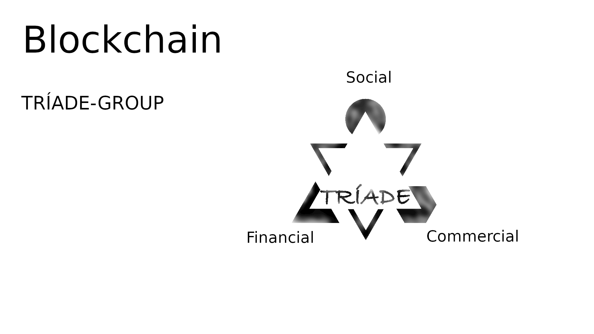

# TRÍADE-API

## The interface between all application's datas and all peer nodes.
___

TRÍADE-API is 1 of 3 TRÍADE-Interfaces (TRÍADE-API, TRÍADE-CLI, TRÍADE-GUI)

| TRÍADE-Services: | TRÍADE-API | TRÍADE-CLI | TRÍADE-GUI | LINK: |
| :--- | :---: | :---: | :---: | :---: |
| TRÍADE-BLOCKCHAIN | true | true | true | [Node link]("https://triade-api.vercel.app/") |
| TRÍADE-GROUP | true | false | true | [Node link]("https://triade-group.vercel.app/") |
| TRÍADE-DEVELOPERS | true | false | true | [Node link]("https://triade-group.vercel.app/") |

___

## TRÍADE-DEVELOPERS

     

___

## [TRÍADE BLOCKCHAIN]("https://triade-api.vercel.app/api/chain/download")

| ACTOR: |
| :---: |
| User |
| Fullnode |
| Miner |

     

___

## [TRÍADE GROUP]("https://triade-group.vercel.app/")

| Official: |
| :---: |
| TRÍADE-Social |
| TRÍADE-Commercial |
| TRÍADE-Financial |

     

___

## Genesis Momentum

The Genesis Momentum is a snap moment in time when Blockchains Borns. There is a Genesis Block that have no Previous Hash, a Genesis Timestamp when there is nothing before, a Genesis Peer whitch is the first peer that spread every content and endpoints to new peers, and a Genesis Actor who mines the first Block, win the firsts Tokens and do the first Contract.

___

- ### [Genesis Block]("https://triade-api.vercel.app/api/chain/block/1")

The Genesis Block has made at 2022-08-27T00:00:00.000Z ([Genesis Timestamp]("https://triade-api.vercel.app/api/chain/block/1"):"1661558400000"), spreat by the [Gennesis Peer]("https://triade-api.vercel.app/api/chain"). 

___

- ### [Genesis Peer]("https://triade-api.vercel.app/api/chain/endpoint")

The Genesis Peer has been ["https://triade-api.vercel.app/api/chain/endpoint-list"]("https://triade-api.vercel.app/api/chain/endpoint-list"). Here You may post your endpoint and become a Peer, or get an enpoint to connect to a Peer.

___

